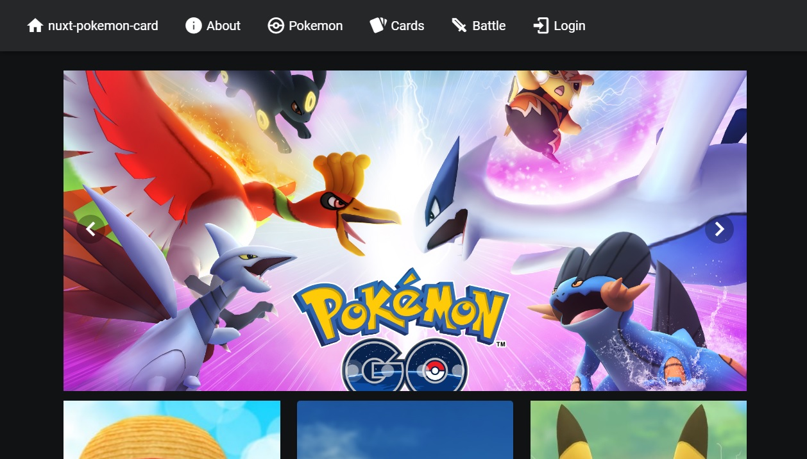
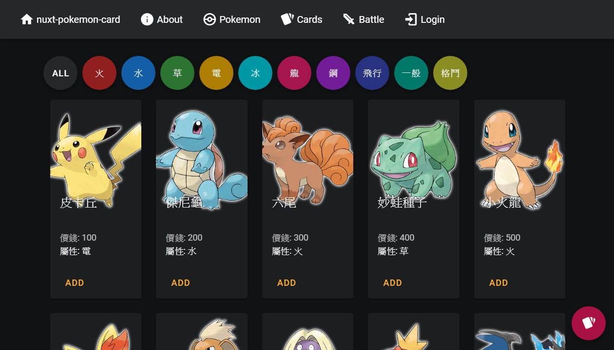
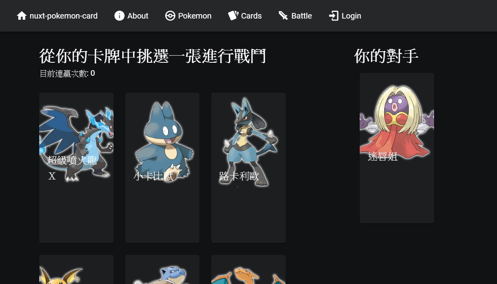

# nuxt-pokemon-card 寶可夢卡牌對戰

使用 Nuxt.js，Vuetify 建立 UI，串接由 Node.js Express MongoDB Atlas Heroku 建立之 RESTful API 取得資料。
，

# Live Demo

<a href="https://v8661087.github.io/nuxt-pokemon-card" target="_blank">https://v8661087.github.io/nuxt-pokemon-card</a>

# 簡介

主要功能:

<li>寶可夢(分類)、卡片檢視、對戰、管理員登入、登出</li>

# 使用技能

<li>Nuxt.js</li>
<li>Vuetify</li>

# 圖片來源

<li>google圖片</li>
<li>寶可夢圖鑑 <a href="https://tw.portal-pokemon.com/play/pokedex">https://tw.portal-pokemon.com/play/pokedex</li>
